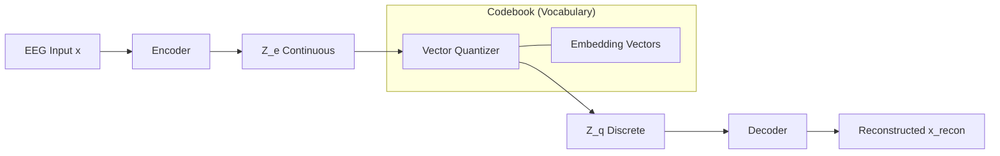

# Архитектура ЭЭГ-Токенайзера (VQ-VAE)

Данный проект реализует дискретный токенайзер для данных ЭЭГ на базе архитектуры **Vector Quantized Variational Autoencoder (VQ-VAE)**. Токенайзер преобразует непрерывные сигналы мозга в последовательность дискретных индексов (токенов), что позволяет использовать трансформеры для генерации или анализа ЭЭГ.

---

## 1. Общая схема системы

Процесс обработки сигнала можно представить следующей цепочкой:
`Входной сигнал (x) → Энкодер → Квантование (VQ) → Декодер → Реконструкция (x̂)`




---

## 2. Компоненты архитектуры

### А. Энкодер (Encoder)
Энкодер сжимает входной вектор признаков (размерность 256) в латентное пространство (размерность 64).

**Структура из кода:**
```python
self.encoder = nn.Sequential(
    nn.Linear(input_dim, hidden_dim), # 256 -> 256
    nn.BatchNorm1d(hidden_dim),
    nn.ReLU(),
    nn.Linear(hidden_dim, hidden_dim), # 256 -> 256
    nn.ReLU(),
    nn.Linear(hidden_dim, embedding_dim), # 256 -> 64
)
```

### Б. Векторный Квантователь (Vector Quantizer)
Это "сердце" токенайзера. Он заменяет непрерывный вектор $z_e$ на ближайший к нему вектор $e_k$ из обучаемого словаря (Codebook).

#### 1. Нормализация (L2 Normalization)
Для стабильности обучения используется косинусная близость, реализованная через L2-нормализацию векторов:
$$ \hat{z}_e = \frac{z_e}{\|z_e\|_2}, \quad \hat{e} = \frac{e}{\|e\|_2} $$

#### 2. Поиск ближайшего соседа
Вычисляется квадрат расстояния между входным вектором и всеми векторами словаря:
$$ d(z, e) = \|\hat{z}_e - \hat{e}\|_2^2 = 2 - 2 \cdot (\hat{z}_e \cdot \hat{e}^T) $$
Индекс токена $k$ выбирается как:
$$ k = \arg\min_j d(\hat{z}_e, \hat{e}_j) $$

#### 3. Straight-Through Estimator (STE)
Так как операция `argmin` недифференцируема, используется STE для проброса градиента от декодера напрямую к энкодеру:
$$ z_q = z_e + sg[z_q - z_e] $$
*(где $sg$ — stop-gradient)*

### В. Декодер (Decoder)
Восстанавливает исходный сигнал из квантованного представления.

**Структура из кода:**
```python
self.decoder = nn.Sequential(
    nn.Linear(embedding_dim, hidden_dim), # 64 -> 256
    nn.ReLU(),
    nn.Linear(hidden_dim, hidden_dim), # 256 -> 256
    nn.ReLU(),
    nn.Linear(hidden_dim, input_dim) # 256 -> 256
)
```

---

## 3. Функции потерь (Loss Functions)

Общий Loss состоит из трех частей:
$$ L_{total} = L_{recon} + L_{codebook} + \beta \cdot L_{commit} $$

1.  **Reconstruction Loss ($L_{recon}$)**: Ошибка восстановления (MSE).
    $$ L_{recon} = \|x - \hat{x}\|^2 $$
2.  **Codebook Loss ($L_{codebook}$)**: Притягивает векторы словаря к выходам энкодера.
    $$ L_{codebook} = \|sg[z_e(x)] - e\|^2 $$
3.  **Commitment Loss ($L_{commit}$)**: Заставляет энкодер выдавать значения, близкие к векторам словаря (с весом $\beta=0.1$).
    $$ L_{commit} = \|z_e(x) - sg[e]\|^2 $$

---

## 4. Особенности реализации

### Мёртвые токены (Dead Code Revival)
В процессе обучения некоторые векторы в словаре могут никогда не выбираться ("умирать"). В данном проекте реализован механизм реанимации:
Если индекс не использован в батче, он принудительно заменяется на один из нормализованных входных векторов из этого же батча:

```python
if self.training:
    # Поиск неиспользованных индексов
    dead_indices = all_indices[~used_mask]
    if len(dead_indices) > 0:
        # Случайный выбор векторов из текущего входа для замены
        new_weights = flat_input_norm[rand_inputs_idx].detach()
        self._embedding.weight.data[dead_indices] = new_weights
```

### Метрика Perplexity
Используется для мониторинга эффективности использования словаря. Показывает, сколько в среднем токенов активно используется.
$$ Perplexity = \exp\left( -\sum p(k) \log p(k) \right) $$
Где $p(k)$ — вероятность выбора токена $k$ в батче. Идеальное значение равно размеру словаря (напр. 4096).
